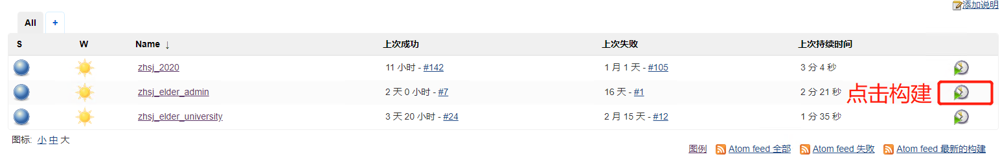
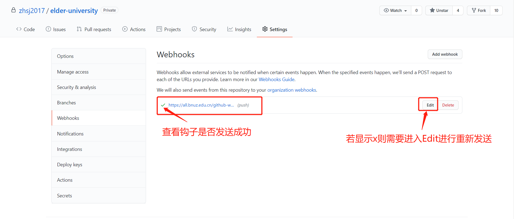

# Jenkins

### 简介
>Jenkins是开源CI&CD软件领导者， 提供超过1000个插件来支持构建、部署、自动化， 满足任何项目的需要。

### 服务器相关

| 服务器类型                | 链接IP            | Jenkins访问地址 |
| ------------------- |:-------------: | ---: |
| 正式服务器 | 172.20.13.16 | localhost:8080 |
| 测试服务器 | 172.31.44.162 | localhost:8080 |
:::danger
关于Jenkins构建，由于代码变动较为频繁，在测试服务器时Jenkins在git Commit触发时将会进行自动构建，而为了保证正式服务器的稳定，在正式服务器中需要手动点击对应项目进行构建
:::

### 正式服构建步骤
+ 链接正式服务器
+ 访问localhost:8080
+ 登录Jenkins
+ 点击构建

:::warning
+ 注意github钩子是否发送成功!!!

+ 注意关注Jenkins是否成功进行构建，若无成功需要具体查看输出进行修复
:::